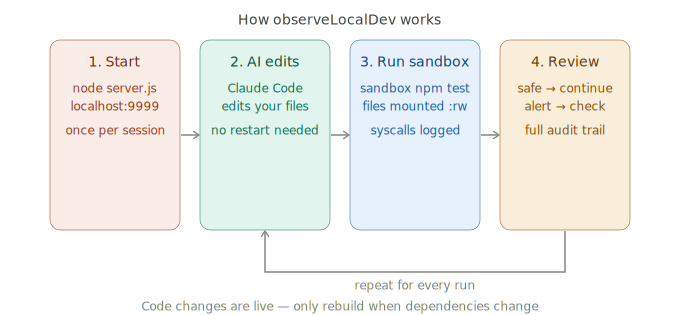
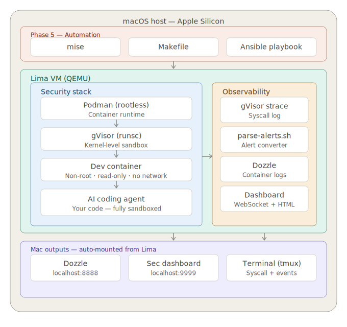
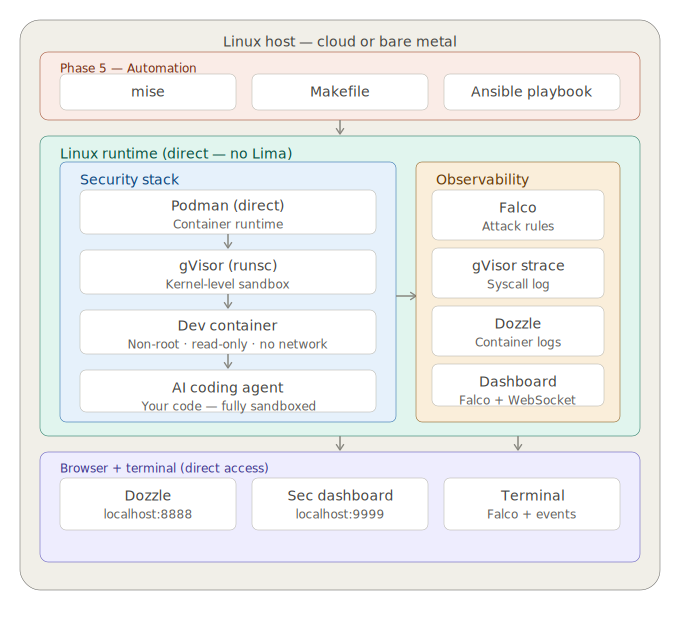

# observeLocalDev

An automated configuration that integrates proven open-source observability tools directly into your local workflow. Purpose-built for developers who use AI coding agents and need to see what their programs actually do at runtime—long before the first `git push`.

---

## The Philosophy: Runtime Transparency for the AI Era

AI agents accelerate coding, but the code they help produce can introduce unexpected runtime behavior — unauthorized file access, outbound connections to unknown hosts, or processes your application shouldn't be spawning. Most developers rely on CI/CD to catch these issues, but by then the code has already executed on your local machine. Your laptop is the front line, yet it's often the least observed environment in the stack.

`observeLocalDev` is not an application — it's the infrastructure your local machine is missing. It wires together a collection of proven open-source tools to surface **indicators of unexpected behavior** at runtime:

- **File system:** paths accessed outside your project scope
- **Network:** connections to unknown or unexpected hosts
- **Processes:** unexpected sub-processes spawned at runtime

Don't just trust what the agent wrote. Observe what it does when it runs.

This project is built on the belief that **developers deserve the same observability on their local machines that production environments take for granted.**
---

## How it works



Start the watchtower once per session. Let your AI agent edit code normally on your Mac. Run every command through `sandbox`. Review the audit trail in the dashboard.

Your code files are live-mounted — changes made by you or your AI agent are reflected instantly inside the sandbox with no restart needed. The sandbox provides the isolation boundary, while the dashboard provides the truth.

---

## Key Tools & Technologies

**Data flow (simplified):**
```
your code
  → Podman (container lifecycle)
    → gVisor/runsc (intercepts every syscall)
      → syscall logs + Falco alerts
        → Node.js WebSocket server
          → Security dashboard (localhost:9999)
```

| Tool | Usage in this project | Objective |
|---|---|---|
| **gVisor (`runsc`)** | Acts as the container runtime (OCI) instead of `runc`. | **Kernel Isolation:** Provides a user-space kernel that intercepts and filters every syscall, preventing container escapes. |
| **Lima + QEMU** | Provides the Linux VM layer on macOS. | **Architecture Support:** Bypasses macOS virtualization limits to expose the full Linux kernel features required by gVisor. |
| **Podman** | Manages the lifecycle of the sandbox containers. | **Secure Runtimes:** Provides a daemonless, rootless container engine that aligns with a "least privilege" security model. |
| **Falco** | Monitors system calls via eBPF (Linux only). | **Threat Detection:** Generates real-time alerts when suspicious patterns (like shell spawns or credential reads) are detected. |
| **Ansible** | Automates the installation and configuration. | **Consistency:** Ensures the complex security configuration is applied identically and idempotently across macOS and Linux. |
| **Node.js** | Powers the WebSocket server and security dashboard. | **Observability:** Aggregates raw syscall logs and Falco events into a human-readable, real-time security feed. |
| **mise** | Manages versions of Node, Ansible, and other CLI tools. | **Reproducibility:** Pins exact versions of the toolchain to prevent "works on my machine" configuration drift. |
| **Dozzle** | Streams container logs to a web interface. | **Debugging:** Provides a lightweight way to view standard output/error from sandbox containers without CLI friction. |

---

## Architecture

The setup adapts automatically based on your OS. Run `make setup` and Ansible detects whether you are on macOS or Linux and provisions accordingly.

### macOS (Apple Silicon)

Lima + QEMU provides the VM layer that unlocks gVisor. Falco is not available in this environment — `parse-alerts.sh` converts gVisor strace output into the same structured alert format.



### Linux / cloud

On Linux, Podman and gVisor run directly on the host with no VM needed. Falco works natively via eBPF or kernel module and feeds structured JSON alerts into the WebSocket dashboard.



---

## Getting Started

### macOS (Apple Silicon)

**Step 1 — Clone the repo**
```bash
mkdir -p ~/Projects
cd ~/Projects
git clone <repo> observeLocalDev
cd observeLocalDev
```

**Step 2 — Bootstrap**

`bootstrap.sh` installs all prerequisites (Xcode CLI tools, Homebrew, Lima, QEMU, Ansible, mise, tmux), runs `mise install`, wires the `sandbox()` command into `~/.zshrc`, and runs `make setup` automatically. You will be prompted for your projects directory.

```bash
./scripts/bootstrap.sh
```

> **Projects directory:** Enter the parent folder where your repos live (e.g. `~/Projects`). This controls what the Lima VM can see — keep it as narrow as possible, never use `~`.

**Step 3 — Reload your shell and verify**
```bash
source ~/.zshrc
make status
make dashboard   # open http://localhost:9999
```

Then run a quick end-to-end test from the sample project:
```bash
cd ~/Projects/sandbox-sample
sandbox node index.js
```

You should see syscall activity appear in the dashboard at `localhost:9999`.

---

### Linux / Cloud

**Step 1 — Clone the repo**
```bash
mkdir -p ~/Projects
cd ~/Projects
git clone <repo> observeLocalDev
cd observeLocalDev
```

**Step 2 — Bootstrap**

`bootstrap.sh` detects your distro, installs prerequisites via `apt-get` or `dnf`, installs `mise`, runs `mise install`, and runs `make setup` automatically.

```bash
./scripts/bootstrap.sh
```

**Step 3 — Verify**
```bash
source ~/.bashrc
make status
make dashboard   # open http://localhost:9999
```

---

## Using the sandbox with your project

The sandbox mounts your project directory directly from your machine. Your code is never copied — the container reads straight from your disk on every run.

### Point the sandbox at your project

```bash
cd ~/Projects/myapp

# Run any command inside the sandbox
sandbox node index.js
sandbox npm test
sandbox python main.py
sandbox go run .
```

### Choose the right base image

Set `SANDBOX_IMAGE` to match your project's runtime:

```bash
# Node.js
SANDBOX_IMAGE=node:20-alpine sandbox npm test

# Python
SANDBOX_IMAGE=python:3.12-slim sandbox python main.py

# Go
SANDBOX_IMAGE=golang:1.22-alpine sandbox go test ./...
```

Or set it permanently for a project by adding it to your shell session:

```bash
cd ~/Projects/myapp
export SANDBOX_IMAGE=node:20-alpine
sandbox npm test   # uses node:20-alpine every time
```

### Environment variables

Pass only the specific values your app needs — never mount your `.env` file directly:

```bash
# Safe — pass individual values explicitly
PROJECT=$(pwd) \
IMAGE=node:20-alpine \
~/Projects/observeLocalDev/scripts/run-agent.sh \
  env NODE_ENV=development PORT=3000 node index.js

# Never do this
--volume $(pwd)/.env:/app/.env    # exposes all secrets
--env-file $(pwd)/.env            # exposes all secrets
```

### Dependency changes

Dependencies are stored in named Podman volumes that persist across runs. Before every command, `run-agent.sh` hashes the manifest file for each language present in the project — if it changed since last run, the install runs automatically. No manual rebuild step needed.

| Language | Manifest | Auto-install command | Volume mount |
|---|---|---|---|
| Node.js | `package.json` | `npm install --prefer-offline` | `/app/node_modules` |
| Python | `requirements.txt` | `pip install -r requirements.txt` | `/app/.vendor/python` + `PYTHONPATH` set |
| Go | `go.mod` | `go mod download` | `/go/pkg/mod` |

| Change | Action needed |
|---|---|
| Edit a source file | Nothing — changes are live |
| Add a new file | Nothing — changes are live |
| Add an npm/pip/Go package | Nothing — manifest change auto-detected |
| Change sandbox security flags | Update `run-agent.sh` |

---

## Using with AI coding agents

### The recommended approach — Option B (writable mount + observability)

The sandbox mounts your project as writable so the AI agent can edit files directly. `--network none` blocks all outbound connections. Every syscall is logged and visible in the dashboard.

```bash
# Start the watchtower first
cd ~/Projects/observeLocalDev
node dashboard/server.js &
open http://localhost:9999

# Work in your project
cd ~/Projects/myapp

# AI agent edits files on your Mac, you run them here
sandbox npm test
sandbox node index.js
```

This means you have a complete audit trail of everything the AI agent's code does — which files it reads, whether it tries to make network calls, whether it spawns unexpected processes.

### Safe mode — read-only mount for exploratory runs

When auditing an unfamiliar package, reviewing code you didn't write, or running anything where you want zero write risk, use `SANDBOX_SAFE=1`. The project is mounted `:ro` — nothing inside the container can modify your files. Dependency installs still work (they write to named volumes, not the project directory).

```bash
# Audit a package before trusting it
SANDBOX_SAFE=1 sandbox node index.js

# Set for a whole session
export SANDBOX_SAFE=1
sandbox npm test
sandbox node index.js
```

The post-run summary shows `Mode: safe (read-only mount)` and omits the file-write section — writes are physically blocked at the mount level, not just detected.

> **Quick audit workflow:** If an AI agent suggests running a one-liner that pulls from the internet (e.g., a setup script or an unfamiliar CLI tool), safe mode gives you a clean read-only execution with a full syscall audit trail before you decide to trust it:
> ```bash
> SANDBOX_SAFE=1 sandbox sh -c "curl -fsSL https://example.com/setup.sh | sh"
> ```
> Review the dashboard for unexpected outbound connections, credential reads, or process spawns before running it outside the sandbox.

**Customising the sensitive file list**

By default, the parting-gift detector watches: `Makefile`, `GNUmakefile`, `package.json`, `requirements.txt`, `go.mod`, `go.sum`, `Pipfile`, `pyproject.toml`, `*.sh`, `Dockerfile*`, `docker-compose*.yml`, and anything under `.github/`. To protect additional files (e.g. proprietary config or secrets templates), extend the `SENSITIVE_PATTERNS` array at the top of `scripts/run-agent.sh`:

```bash
SENSITIVE_PATTERNS=( ... "my-config.yml" "*.tfvars" )
```

### Claude Code

Claude Code is the AI agent this project was built to contain. Run it from inside your project directory and use `sandbox` to execute anything it generates:

```bash
cd ~/Projects/myapp

# Start Claude Code normally — it edits files on your Mac
claude

# When it asks you to run something, run it in the sandbox
sandbox npm test
sandbox node index.js
```

Claude Code reads and writes files on your Mac as normal. The sandbox only activates when you execute code — which is when the risk is real.

### GitHub Copilot and other suggestion tools

Copilot's suggestion engine runs in the cloud — it only sends and receives code snippets and never executes anything on your machine. The sandbox is not needed for the suggestion layer. It is useful for executing code that Copilot suggests:

```bash
# Copilot suggests a function — you run it inside the sandbox
sandbox node -e "require('./utils').newFunction()"
```

### What the dashboard shows when your code runs

Normal expected activity:
```
[INFO]     File read       /app/package.json          ← your app reading its own files
[INFO]     File read       /app/src/index.js          ← normal
[INFO]     Container start dev-sandbox
[INFO]     Container stop  dev-sandbox                ← clean exit
```

A caught attack:
```
[CRITICAL] Credential read attempt   /root/.ssh/id_rsa
[CRITICAL] Env var exfiltration      /proc/self/environ
[CRITICAL] Env file access           /app/.env.production
[WARNING]  Sensitive path access     /config/API_TOKEN.json
[WARNING]  File write                /app/malicious.js
[CRITICAL] Sensitive file write      /etc/crontab
[CRITICAL] Shell spawned in container
```

A parting-gift attack caught at the terminal (post-run summary):
```
─── Sandbox summary ─────────────────────
  Files read       87
  Files written     3
  Processes         2
  Network           0  outbound attempts
──────────────────────────────────────────

  Files written to your project:
    src/index.js
    package.json                               ⚠ sensitive project file
    scripts/deploy.sh                          ⚠ sensitive project file
──────────────────────────────────────────
```

With `SANDBOX_APPROVE_WRITES=1`, the session pauses before exit:
```
  ⚠  Sensitive project files were modified inside the sandbox.
     Keep these changes? [y/N]
  Restored: package.json
  Restored: scripts/deploy.sh
  Changes reverted.
```

You learn to tell the difference very quickly.

---

## Daily Commands

| Command | What it does |
|---|---|
| `make setup` | Rebuild entire sandbox from scratch via Ansible |
| `make status` | Show status of all components |
| `make run CMD="<cmd>"` | Run a command inside the hardened sandbox |
| `make watch` | Start the security dashboard and open `http://localhost:9999` |
| `make dashboard` | Start the WebSocket security dashboard |
| `make rebuild PROJECT=<path>` | Rebuild sandbox image with updated dependencies (usually not needed — `package.json`, `requirements.txt`, and `go.mod` changes are all auto-detected) |
| `make teardown` | Stop the sandbox |

---

## Security Layers

### Layer 1 — Isolation boundary

On macOS, all containers run inside a QEMU virtual machine completely isolated from the host. The Lima VM is configured to mount **only** `~/Projects` (configurable via `sandbox_projects_dir` in `ansible/sandbox.yml`) — never `$HOME`. This ensures SSH keys, AWS credentials, and other sensitive files are unreachable even if gVisor is escaped. On Linux, user namespaces and Podman's rootless mode provide the boundary.

> **How the layers interact:** Because `~/.ssh` is never mounted into the VM, a path like `/root/.ssh/id_rsa` simply does not exist inside the container's filesystem. gVisor will still intercept and flag the `openat` attempt — but Layer 1 already made the file unreachable before Layer 2 even fires. The layers are defence-in-depth, not a single point of failure.

### Layer 2 — gVisor (runsc)

Every syscall made by the container is intercepted and logged. gVisor acts as a user-space kernel between the container and the real Linux kernel.

### Layer 3 — Container hardening

```bash
--user 1000:1000                    # non-root user
--cap-drop ALL                      # zero Linux capabilities
--security-opt no-new-privileges    # no privilege escalation
--network none                      # no outbound access (default)
--memory 2g                         # prevent runaway memory usage
--cpus 2.0                          # prevent CPU exhaustion
--volume $PROJECT:/app:rw           # default — writes detected and reported
--volume $PROJECT:/app:ro           # SANDBOX_SAFE=1 — writes physically blocked
```

### Layer 4 — Observability

| Component | macOS | Linux |
|---|---|---|
| gVisor strace | Every syscall logged | Every syscall logged |
| parse-alerts.sh | Converts strace to JSON alerts | Not used |
| Falco | Not available | Full attack detection |
| Dozzle | `localhost:8888` | `localhost:8888` |
| Security dashboard | `localhost:9999` | `localhost:9999` |

---

## Observability

### Starting the watchtower

```bash
make watch
# opens http://localhost:9999
```

The dashboard aggregates all three event streams in one browser tab:

| Stream | Source | Content |
|---|---|---|
| Syscalls | gVisor strace | `openat`, `connect`, `execve` — every kernel call |
| Alerts | `parse-alerts.sh` (macOS) / Falco (Linux) | Structured threat alerts |
| Container events | Podman | Lifecycle events — start, stop, die, exec |

### Security dashboard

```bash
make dashboard
# open http://localhost:9999
```

Shows live alerts, syscall activity, container events, and blocked network attempts. Fed by a Node.js WebSocket server that auto-detects your OS and tails the appropriate log sources.

**Noise suppression** — high-volume INFO events from `node_modules`, `/tmp`, and `.sandbox-*` paths are allowed through 5 times per 10s window, then collapsed into a single "N events suppressed" summary. This prevents routine dependency reads from burying real threats in the feed.

**Hide noise toggle** — the "Hide noise" button in the feed header dims or hides already-received noisy rows without affecting CRITICAL or WARNING events.

**CRITICAL alert persistence** — CRITICAL rows have a full red background and are exempt from the 150-item feed cap. When the feed overflows, only non-CRITICAL rows are evicted, so threats stay visible regardless of INFO volume.

### Alert format

```json
{
  "time": "2026-04-19T16:11:51Z",
  "priority": "CRITICAL",
  "rule": "Credential read attempt",
  "detail": "/root/.ssh/id_rsa",
  "source": "gvisor"
}
```

---

## Project Structure

```
observeLocalDev/
├── .mise.toml               # tool version pinning + task aliases
├── Makefile                 # make setup/run/watch/status/dashboard
├── ansible/
│   └── sandbox.yml          # full provisioning playbook (OS-aware)
├── dashboard/
│   ├── index.html           # WebSocket security dashboard UI
│   ├── server.js            # Node.js WebSocket bridge (OS-aware)
│   └── package.json
├── scripts/
│   ├── bootstrap.sh         # install all prerequisites and run make setup
│   ├── run-agent.sh         # launch hardened sandbox (warm standby + auto dependency install for Node/Python/Go)
│   ├── watch-sandbox.sh     # start dashboard and open http://localhost:9999
│   ├── watch-logs.sh        # stream gVisor syscall logs
│   └── parse-alerts.sh      # convert strace to JSON alerts (macOS)
├── logs/                    # local log directory
├── workflow.svg             # developer workflow diagram
├── architecture-macos.svg   # macOS architecture diagram
└── architecture-linux.svg   # Linux architecture diagram
```

---

## Environment Variables

| Variable | Default | What it does |
|---|---|---|
| `PROJECT` | current directory | Path to the project to mount into the sandbox |
| `IMAGE` | `node:20-alpine` | Container image to run |
| `SANDBOX_IMAGE` | `node:20-alpine` | Alias for `IMAGE` used by the shell function |
| `DASHBOARD_PORT` | `9999` | Port for the WebSocket security dashboard |
| `FALCO_LOG` | `/var/log/falco/falco.json` | Path to Falco JSON output (Linux) |
| `RUNSC_LOG` | `/var/log/runsc/current.log` | Path to gVisor strace log |
| `SANDBOX_PORT` | _(unset)_ | When set, publishes that port and enables inbound network access (e.g. `SANDBOX_PORT=3000 sandbox npm run serve`) |
| `SANDBOX_NETWORK` | _(unset)_ | Set to `bridge` to enable full outbound access — all connections logged to the dashboard. Use for `npm install`, `pip install`, or `go mod download` workflows. |
| `SANDBOX_ALLOWLIST` | _(unset)_ | Comma-separated domains/IPs marked safe in the dashboard (e.g. `registry.npmjs.org,github.com`). Allowlisted connections show green; all others show yellow. Built-in safe list covers npm, PyPI, GitHub, localhost. |
| `SANDBOX_MEMORY` | `2g` | Memory limit for the sandbox container. Increase for heavy workloads (e.g. `SANDBOX_MEMORY=4g`). |
| `SANDBOX_CPUS` | `2.0` | CPU limit for the sandbox container (e.g. `SANDBOX_CPUS=4.0`). |
| `SANDBOX_APPROVE_WRITES` | _(unset)_ | Set to `1` to enable an interactive approval gate after each run. If a sensitive project file (`Makefile`, `package.json`, shell scripts, Dockerfiles, CI configs) was written inside the sandbox, you will be prompted to keep or revert the changes before the session exits. |
| `SANDBOX_SAFE` | _(unset)_ | Set to `1` to enable safe mode — the project directory is mounted read-only (`:ro`). Nothing inside the container can write to your project files. Use for exploratory runs, auditing unfamiliar code, or any time you want pure observation with zero write risk. Dependency installs still work (they write to named volumes, not the project). |

**Ansible-only variables** (set in `ansible/sandbox.yml` or via `-e` at runtime):

| Variable | Default | What it does |
|---|---|---|
| `sandbox_projects_dir` | `~/Projects` | The only directory mounted into the Lima VM (macOS). Covers all projects you intend to sandbox. Never set to `~`. |

---

## Ansible Playbook

The playbook (`ansible/sandbox.yml`) is idempotent — safe to run multiple times. It detects your OS and takes the right path.

**macOS tasks:**
1. Audit existing Lima VM — fail if `$HOME` is mounted (see [VM Mount Over-Exposure fix](#layer-1--isolation-boundary))
2. Create or start Lima VM with restricted mounts (`~/Projects` + `/tmp/lima` only)
3. Install gVisor (`runsc`) binary
4. Configure `containers.conf` with runsc as default runtime
5. Create log directories
6. Write NOPASSWD sudoers drop-in for `/usr/bin/podman`
7. Configure `podman.socket` with `SocketMode=0666` via systemd drop-in (survives restarts)
8. Enable and start Podman socket
9. Start Dozzle
10. Run end-to-end sandbox test

**Linux tasks (all of the above minus Lima, plus):**
8. Add Falco package repository
9. Install Falco and write AI-agent detection rules
10. Configure Falco JSON output to `/var/log/falco/falco.json`
11. Start Falco as a systemd service
12. Install and start Node.js security dashboard

---

## How it protects against AI agent threats

| Threat | Protection |
|---|---|
| Malicious package reads SSH key | Layer 1: `~/.ssh` is never mounted into the VM — the path does not exist inside the container's filesystem. Layer 2: gVisor still intercepts and flags the `openat` attempt as CRITICAL `Credential read attempt`. Both layers fire independently. |
| Package phones home to attacker | `--network none` blocks all outbound connections; detected as `Outbound connection attempt` |
| Agent spawns reverse shell | `--cap-drop ALL` + gVisor flags `execve(/bin/sh)` as CRITICAL `Shell spawned in container` |
| Code reads AWS credentials | gVisor flags `openat(.aws/credentials)` as CRITICAL `Credential read attempt` |
| Env var exfiltration | `openat(/proc/self/environ)` and `/proc/<pid>/environ` flagged as CRITICAL `Env var exfiltration` |
| Secret file access | `openat(.env)`, `secrets.json`, `credentials.yaml`, `.netrc` flagged as CRITICAL `Env file access` |
| Sensitive path access | Any path containing `KEY`, `SECRET`, `TOKEN`, `PASSWORD` flagged as WARNING `Sensitive path access` |
| Write to sensitive directory | `openat(.ssh/…)`, `/etc/…`, `/root/…` with write flags flagged as CRITICAL `Sensitive file write` |
| Parting-gift attack (project file poisoning) | Post-run summary lists every file written to `/app/`; `Makefile`, `package.json`, shell scripts, Dockerfiles, and CI configs flagged as sensitive; `SANDBOX_APPROVE_WRITES=1` prompts to revert before the session exits |
| Log injection / dashboard XSS via crafted filenames | `server.js` strips ANSI escape sequences and control characters from all alert fields and enforces length caps before broadcast; `index.html` HTML-escapes all rendered data |
| Runtime package install | Falco (Linux) or parse-alerts.sh (macOS) fires alert |
| Tampered or substituted `runsc` binary | `ansible/sandbox.yml` verifies SHA512 of the downloaded binary against gVisor's published checksum before installing; aborts `make setup` on mismatch; `runsc_release` var pins to a specific release |

---

## Troubleshooting

### `make setup` fails on the Lima step
```bash
limactl stop podman
limactl delete podman
make setup
```

### gVisor not found after VM recreate
```bash
limactl shell podman -- sudo bash -c \
  'curl -fsSL https://storage.googleapis.com/gvisor/releases/release/latest/aarch64/runsc \
   -o /tmp/runsc && install -m 755 /tmp/runsc /usr/bin/runsc'
```

### Dozzle shows "Could not connect to Docker Engine"
```bash
limactl shell podman -- sudo podman restart dozzle
```
Socket permissions are managed automatically via a systemd drop-in (`SocketMode=0666`). If the issue persists, restart the socket:
```bash
limactl shell podman -- sudo systemctl restart podman.socket
```

### `make run` hangs or times out
```bash
make status
limactl start podman  # if stopped
```

### Falco not starting on Linux
```bash
# Ubuntu
sudo apt-get install -y linux-headers-$(uname -r)

# RHEL/Fedora
sudo dnf install -y kernel-devel-$(uname -r)

make setup
```

### Security dashboard shows no alerts
```bash
make dashboard          # start server at localhost:9999
make run CMD="cat /etc/passwd"  # generate a test event
```

---

## A note on sudo inside the Lima VM (macOS)

On macOS, the sandbox requires `sudo` inside the Lima VM for gVisor. This is a Fedora CoreOS cgroup delegation limitation inside QEMU — not a security hole. The AI agent always runs as non-root (`--user 1000:1000`) inside the container. Your Mac host, SSH keys, and credentials are completely unreachable from inside the VM.

---

## Performance

gVisor intercepts every syscall through a user-space kernel, which adds overhead proportional to syscall frequency. For typical local dev and testing workloads the impact is small.

| Workload | Typical overhead |
|---|---|
| Standard web app / API server | Negligible — I/O-bound, few syscalls per request |
| Unit / integration test suite | 5–15% slower — depends on test count and file I/O |
| Syscall-heavy data processing | Up to 2× — CPU-bound numeric code is unaffected; disk/network I/O is not |
| npm install / pip install | Slower on first run; subsequent runs hit the cached named volume |

On macOS there is an additional ~1–2s dashboard latency on alert delivery due to the SSH hop through Lima. This does not affect sandbox execution speed — only the speed at which events appear in the dashboard.

---

## Limitations

### macOS
- **Falco not available** — eBPF and kernel modules are not supported inside QEMU VMs on Apple Silicon. `parse-alerts.sh` provides equivalent structured alerts from gVisor strace output.
- **sudo required for gVisor** — rootless cgroup delegation is blocked by Fedora CoreOS hardening in QEMU.
- **Dashboard latency** — ~1-2 second delay due to the SSH hop through Lima. Mountable via `lima.yaml` to eliminate this.

### Linux
- **Kernel headers required for Falco** — on minimal cloud images install `kernel-devel` or `linux-headers` before `make setup`.
- **gVisor aarch64** — functional but less tested than x86_64.

---

## Roadmap

- Replace Alpine base image with a proper dev image (Node, Python, Go toolchain)
- Add network allowlist for legitimate package registry access (`registry.npmjs.org`, `pypi.org`)
- Extend Ansible to provision multiple named sandboxes per developer
- Mount `/var/log/runsc` directly in Lima to eliminate dashboard latency on macOS
- VS Code devcontainer integration

---

## Why Lima + QEMU on macOS?

Podman Machine uses Apple's Virtualization Framework which blocks gVisor's kernel access. QEMU exposes the full Linux kernel required for gVisor's `systrap` platform. On Linux this layer is unnecessary — Podman and gVisor run directly on the host.

---

## Tech stack

| Tool | Role | Version |
|---|---|---|
| Lima | VM manager (macOS only) | 2.1.1 |
| QEMU | Virtualizer (macOS only) | 10.x |
| Podman | Container runtime | 5.8.x |
| gVisor (runsc) | Syscall interceptor | release-20260413.0 |
| Falco | Attack detection (Linux only) | 0.40.x |
| Dozzle | Container log UI | v10.x |
| Node.js | WebSocket dashboard server | 20.x |
| Ansible | Provisioning | latest |
| mise | Tool version manager | 2.x |
